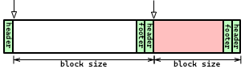
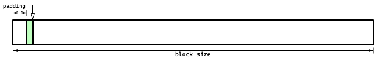
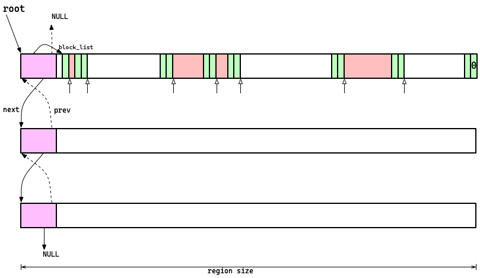
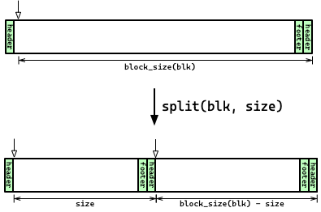
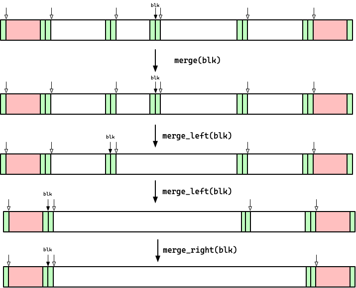

# Lab 5: Implementing a memory allocator

<a name="toc"></a>
<!--ts-->
* [Lab 5: Implementing a memory allocator](#lab-5-implementing-a-memory-allocator)
* [Introduction](#introduction)
   * [Collaboration Policy](#collaboration-policy)
   * [Cloning the lab and getting started](#cloning-the-lab-and-getting-started)
   * [Hand in](#hand-in)
* [Code overview and lab structure](#code-overview-and-lab-structure)
* [Allocator overview](#allocator-overview)
   * [Blocks](#blocks)
   * [Regions](#regions)
   * [Allocator parameters](#allocator-parameters)
   * [Allocator code structure](#allocator-code-structure)
* [Completing the allocator](#completing-the-allocator)
   * [Updating metadata](#updating-metadata)
   * [Updating counters](#updating-counters)
* [General tips](#general-tips)
* [Wrapping up and handing it in](#wrapping-up-and-handing-it-in)
* [Additional challenges](#additional-challenges)

<!-- Created by https://github.com/ekalinin/github-markdown-toc -->
<!-- Added by: langm, at: Wed Nov  9 00:57:19 UTC 2022 -->

<!--te-->

# Introduction

In this lab you will create a memory allocator that can be used as a drop-in
replacement for `malloc`. Your allocator (The 🐯Lynx Allocator🐯™️) will use an
implicit free list with a first-fit allocation strategy (by default).

The objectives of this lab are:

* to gain experience writing system-level software for general clients;
* to gain experience writing and debugging code that manipulates offset-based data
  structures;
* to gain experience reading and understanding technical documentation;
* to develop your understanding of an allocator's design and implementation;
* to continue to develop debugging ability in gdb;
* and, time permitting, to experiment with allocation strategies.

This lab is not broken up into phases.

You are being given a nearly-complete allocator. However, the allocator is
missing some core functionality. Namely, it does not contain implementations of
functions that split and coalesce blocks nor does it contain an implementation
of the `malloc` function itself.

Your task for this lab will be to implement these functions and finish the
implementation of the memory allocator.

__Please read this document before you begin the lab.__

## Collaboration Policy

It is fine to collaborate for this project. However, all code that you turn in
must be your own. You may not copy code directly from others or from the
internet. Copying code and renaming variables _is copying code._ 

You can and should talk about general problems in the lab, how to use specific
functions, etc.

__When you make your PR, note who you worked with on this lab.__  

## Cloning the lab and getting started

When you clone the lab, make sure that the first thing that you do is create a
new branch to work in!

```
$ git clone <your-repo-url>
$ cd <your-repo>
$ git checkout -b <your-branch-name>
```

## Hand in

Your code modifications will be isolated to the `lynx_alloc.c` file. When you
run the tests for the lab, this will also create a `test-output.md` file in the
`src` folder for the lab. Follow the instructions at the end of the lab for how
you should submit these files.

🔝 [back to top](#toc)

# Code overview and lab structure

```
lab5
|-- README.md .................... this file
|-- doc .......................... images used in this file
|   `-- ...
`-- src
    |-- basic_allocs_test.c ...... basic program using allocator
    |-- lynx_alloc.c ............. main source code file for allocator implementation
    |-- lynx_alloc.h ............. main header file for allocator implementation
    |-- lynx_alloc_shared.c ...... shim in order to use allocator as malloc
    |-- lynx_alloc_shared.h ...... header for shim
    |-- Makefile ................. main makefile
    |-- scripts .................. templates for scripts
    |   `-- ...
    |-- sizes.c .................. program to see sizes of ints on this machine
    |-- test-output.md ........... output from running your unit tests
    |-- tests .................... large collection of tests to run
    |   |-- bins ................. lab 3 binaries to test allocator against
    |   |   `-- ...
    |   |-- data ................. data files used in tests
    |   |   `-- ...
    |   |-- Makefile ............. tests makefile
    |   |-- run_tests.py ......... test harness program
    |   |-- test_utils.c ......... utility functions for tests
    |   |-- test_utils.h ......... utility functions header
    |   `-- ...
    `-- util.h ................... utility functions for allocator
```

In this lab, the only code file that you will edit will be `lynx_alloc.c` (you
may want to edit test files, but `lynx_alloc.c` is the only file you
__must__ edit).

It is __extremely__ important that you read __both__ this document as well as
the documentation in `lynx_alloc.h` and `lynx_alloc.c`, as the documentation
required to complete the lab is spread across these three sources.

The section that follows this provides a general overview of the allocator, but
the technical details are as described in the code itself.

## `Make` targets

This lab has several make targets.

* `make all`/`make`: This builds your allocator, a basic test program
  (`basic_allocs_test`), and scripts (`run-with`) that you can use to run
  arbitrary programs with your allocator being used instead of the default
  version of `malloc`.

* `make basic_allocs_test`: This recompiles the `basic_allocs_test.c` file.

* `make scripts`: This target builds a couple of scripts that you can use to run
  your allocator and that may be helpful when using `gdb`. See the [General
  Tips](#general-tips) section below for a description of these scripts.

* `make sizes`: This target builds, runs, and cleans up a small program that
  shows you the size of various integral types on `lily`.

* `make tests`: This recompiles all of the tests in the lab. You should run this
  build target after you make changes to your allocator and want to run tests
  manually.

* `make run_tests`: This target builds (as in `make tests`) __and__ runs __all__
  the tests for this lab. When you run this target, you'll see the following
  output, which is the result of running the tests using a test harness in the
  `tests/` subdirectory:


  ```
  <...snip compiler output...>
  ./run_tests.py -t
  allocate-and-fit-test,region-allocate-test,region-cleanup-test,split-test,coalesce-test,gc-regions-test,calloc-test,realloc-test,reallocarray-test,ls-test,lab3-word-count-test,lab3-stress-test,large-basic-test,large-mixed-test,large-calloc-test,large-realloc-test,scribble-test,set-large-test,region-alignment-test,set-region-test,excruciating-test
  -p ./ -o test-output.md
  Running: ./allocate-and-fit-test .... ✅ passed! (0.003s)
  Running: ./region-allocate-test ..... ✅ passed! (0.003s)
  Running: ./region-cleanup-test ...... ✅ passed! (0.003s)
  Running: ./split-test ............... ✅ passed! (0.003s)
  Running: ./coalesce-test ............ ✅ passed! (0.003s)
  Running: ./gc-regions-test .......... ✅ passed! (0.013s)
  Running: ./calloc-test .............. ✅ passed! (0.003s)
  Running: ./realloc-test ............. ✅ passed! (0.003s)
  Running: ./reallocarray-test ........ ✅ passed! (0.003s)
  Running: ./ls-test .................. ✅ passed! (0.052s)
  Running: ./lab3-word-count-test ..... ✅ passed! (0.101s)
  Running: ./lab3-stress-test ......... ✅ passed! (4.248s)
  Running: ./large-basic-test ......... ✅ passed! (0.003s)
  Running: ./large-mixed-test ......... ✅ passed! (0.003s)
  Running: ./large-calloc-test ........ ✅ passed! (0.003s)
  Running: ./large-realloc-test ....... ✅ passed! (0.003s)
  Running: ./scribble-test ............ ✅ passed! (0.003s)
  Running: ./set-large-test ........... ✅ passed! (0.003s)
  Running: ./region-alignment-test .... ✅ passed! (0.003s)
  Running: ./set-region-test .......... ✅ passed! (0.003s)
  Running: ./excruciating-test ........ ✅ passed! (70.622s)
  all tests passed! 🎉
  ```

  This also creates a file in your `src` directory named `test-output.md`. This
  contains the output of the test programs and will be submitted alongside your
  lab.

  __Note that you can run the tests manually without the automatic test
  harness!__ See the [General Tips](#general-tips) section below for a
  discussion about how to approach work on the lab and how to run/debug tests.

* `make clean`: This cleans everything up and can be run to delete all
  temporary build files.

🔝 [back to top](#toc)

# Allocator overview

This allocator mirrors the structure of the implicit free list allocator
discussed in class. However, it is structured slightly differently.

The allocator is an implicit free list design. 

## Blocks

* The concept of a block is identical to that discussed in class -- a block is a
  contiguous region of the heap that is either used or free.

  |  |
  |:--:|
  | *A pair of regular blocks. Small arrows represent the starts of data regions. The red block is used and the preceding block is free.* |

* Each block starts with a header that includes the size of the block. 

* The data for the block starts immediately after the header. 

* Each block size is a multiple of 16, and the start of the data for a block is
  aligned to a 16-byte boundary (i.e., the address is a multiple of 16).

* The lowest-order (zero) bit of each header represents whether the block is
  used or free.

* The second-lowest-order (first) bit of a header represents whether a block is
  _large_. Large blocks are treated differently from non-large (i.e., _normal_)
  blocks.

* Normal blocks also contain a footer that is identical to the header (i.e.,
  contains the block's size and whether the block is used or free).

* A block's size starts from the block's data and extends to the start of
  the next block's data. This means that the last 8 bytes of each block are used
  for its footer _and the next block's header_.

* Large blocks are slightly different. A large block is allocated with `mmap`
  directly. It header precedes its data as with a normal block, but the header
  contains the size of the entire `mmap` region (including a 12-byte padding at
  the start of the region for the purpose of alignment).

  |  |
  |:--:|
  | *A large block. The padding at the start is 12 bytes.* |

* Note that given a pointer to a header or a pointer to data, it is easy to
  calculate the location of the other by either adding or subtracting the size
  of the header to/from the pointer.

## Regions

* The key difference between this allocator and the one that was discussed in
  class is that this allocator uses what we will call _regions_ to store lists
  of blocks.

* A region is an `mmap`ed region of memory that contains a short header
  containing metadata about a region and a pointer to the block list for the
  region.

* Regions are arranged in a linked list. The metadata for a region contains
  pointers to the previous and next regions. The allocator stores a pointer to
  the first region in the list (called the _root_).

  |  |
  |:--:|
  | *Regions form a linked list* |

* A region's metadata also stores information about how many blocks are
  used/free in the region. This accounting is used to help search for free
  blocks as well as to detect when a region has become free and may be garbage
  collected (`unmap`ed).

* Each region _always_ has at least three blocks. One starts off as
  initially free and can be split as allocations occur and two other blocks that
  are used to prevent edge cases and simplify code. These are:
  
  * A small _initial block_. This block is the minimum size (16 bytes).

  * A zero-size _final block_. This block is 0 bytes (and therefore is not
    actually physically represented--only its header is stored). The size zero
    block is used to detect when the end of the block list for a region has been
    reached.

  * Both of these blocks are always marked used. This simplifies some edge cases
    in coalescing.

* Regions are __always__ the same size, and the size is a multiple of a page
  size (4096 bytes). Regions are always aligned to a multiple of the region
  size. 

  * This allows us to easily calculate the region that a block belongs to--we
    simply go back to the nearest address that is a multiple of the region size.

## Allocator parameters

The allocator has a few parameters that can be set by a user through the use of
environment variables:

* `region_size`: the size of all regions. This must be a multiple of
  4096.

* `max_block_size`: the cutoff size above which a block is a large block. This
  value must be small enough to be allocated within a region.

* `reserve_capacity`: the amount of capacity to reserve at the end of a block
  when splitting the block. This is unused in the current implementation (i.e.,
  it is always 0).

* `min_split_size`: when splitting, the minimum block size that can be created.
  If a split would result in a smaller block, the split does not occur and the
  space is unused padding at the end of the block.

* `scribble_char`: a single-byte value that can be used to initialize memory.
  When nonzero, all allocated blocks are filled with this character. This can be
  used to detect memory errors in programs (i.e., errors where code assumes that
  `malloc` returns blocks that have been zeroed).

## Allocator code structure

`lynx_alloc.c` and `lynx_alloc.h` contain the majority of the code for the
allocator. There are separate `lynx_alloc_shared.{h,c}` files that are used to
translate calls from `malloc`/`free` to `lynx_malloc`/`lynx_free`, but these
have been written for you.

__Header file and client interface:__ `lynx_alloc.h` contains the `struct`
definitions for the allocator and declares the main functions that clients can
use. 

The main functions for The 🐯Lynx Allocator🐯™️ are `lynx_malloc`, `lynx_free`,
`lynx_calloc`, `lynx_realloc`, and `lynx_reallocarray`. There are a few debug
functions that can be called by programs that explicitly use the allocator
(`print_lynx_alloc_debug_info()`, `lynx_alloc_config()`, and
`lynx_alloc_counters()`).

These, in turn, use a large collection of helper functions that are defined in
`lynx_alloc.c`.

__Global variables:__ `lynx_alloc.c` has a few global variables that it uses to store its state:

* `root`: a pointer to the root region.
* `config`: an instance of the configuration struct for the allocator.
* `counters`: debugging/performance counters that we can observe.
* `malloc_init`: a flag indicating whether or not the allocator has been
  initialized.

__Helper functions:__ The code makes extensive use of helper functions that can
compute the size a block, return whether it is used/free, etc. These helper
functions are to be used to prevent one from having to do a ton of pointer
arithmetic and manipulation.

For example, to go from a data pointer to a block, vice-versa, or to go from a
block to its enclosing region:

```C
void *data = ... // pointer we have returned using malloc
// convert to a block
block_t *blk = to_block(data);
// convert to a region
region_t *region = to_region(data); // alternatively: to_region(blk)
// access the next block
block_t *next = block_next(blk);
// access the previous block
block_t *prev = prev_block(blk);
// access the block's footer
block_t *footer = block_ftr(blk);
// access the previous block's footer
block_t *prev_footer = prev_ftr(blk);
// mark it used/free
if (is_free(blk) {
  mark_used(blk);
} else {
  mark_free(blk);
}
// etc.
```

__Region manipulation:__ `lynx_alloc.c` contains a few functions for
manipulating regions. 

* `region_create()` will create an initialize a new region, returning a pointer
  to it.

* `clean_regions()` will delete a region. It assumes that there is at most one
  empty region that can be cleaned up.

It is assumed that the 

__Large block allocation/free:__ `create_large_block()` will create a large
block and `free_large_block()` will free an existing large block.

__Free block selection:__ The primary function that selects a free block from
the free lists for regions is `next_free()`. This function currently implements
the _first-fit_ strategy. Note that it starts its search from the `root` region.
This implies that the search will be faster if the `root` region has free
blocks.

__Splitting and merging:__ There are four functions that deal with splitting
and coalescing of blocks. 

* `split`: Given a block and a desired size for that block, the split function
  will optionally split the block into two smaller blocks. One that is at least
  as large as the desired size, and one that is the remaining size.

  In other words, given a block of size `block_size(blk)` and a desired size
  `size`, we expect the following:

  |  |
  |:--:|
  | *Splitting a block with `split`* |

  __Note:__ this splitting does _not_ occur if `block_size(blk) - size <
  config.min_split_size`. In this case, `split` simply returns and does not
  modify the block.

  __Note:__ the config option `reserve_capacity` can be added to `size` in order
  to create a larger desired region. This is done _internal_ to split.

* `merge`: Given a block, recursively merge it with blocks to its left and
  right. This function relies on two helper functions: `merge_left` and
  `merge_right`.

  * `merge_left(blk)` will merge the given block with the block to its immediate
    left, returning a pointer to the new block. This function will only merge if
    the block to the left is free. The function is recursive: it merges as far
    to the left as possible by repeatedly merging blocks.

  * `merge_right(blk)` is the same as `merge_left`, except that it merges to
    free blocks to the right of the given block. Also note that since merging
    blocks to the right does not change the location of the block, `blk` should
    be unchanged.

  The following illustrates the process of calling `merge` on a block with free
  blocks to its left and right:

  |  |
  |:--:|
  | *Coalescing a block with `merge`* |

🔝 [back to top](#toc)

# Completing the allocator

Much of the allocator has been implemented for you already. The functions that
you must implement are:

* `split`;
* `merge_left` and `merge_right`;
* and `lynx_malloc`.

The general outlines of `split`, `merge_left`, and `merge_right` were discussed
above. The implementation of `lynx_malloc` should generally satisfy the
following requirements:

1. If the size of the allocation request is zero, the function should return
   `NULL`, per the specification of `malloc`: "If `size` is 0, then `malloc()`
   returns either `NULL`, or a unique pointer value that can later be successfully
   passed to free."

2. If the size of the allocation request exceeds the normal block limit, the
   block should be allocated with `create_large_block()` and, since large blocks
   are not split/merged but are freed directly, the work of the function is
   done.

3. If the requested size is under the threshold for a normal block, `malloc`
   should try to find the next free block. If there is no such block, another
   region should be allocated (guaranteeing that a subsequent call to
   `next_free` will succeed). If a region could not be allocated, the call
   should return `NULL` (as per the spec of `malloc`). 

4. Since the returned block may be larger than the requested size, `malloc`
   should attempt to split it.

5. If `config.scribble_char` is set, the block should be scribbled
   (`scribble_block`).

6. Finally, remember that the returned pointer is to the block's data, not the
   block itself.

__Note:__ Remember that size must be a multiple of 16. You can use utility
functions to ensure that this is the case.

## Updating metadata

`split`, `malloc`, and `merge` must perform the accounting necessary to ensure
that the `n_free` and `n_used` values in regions are correct. They must also
make sure to mark blocks as used/free as necessary. You can look at
`lynx_free()` as an example of how metadata must be updated.

## Updating counters

Since the values in `counters` are used for debugging, you should make sure to
update them in `lynx_malloc()`; again, looking at what `lynx_free()` does with
counters will be useful.

# General tips

* __Writing an allocator is hard:__ This is a piece of code that is extremely
  unforgiving of _any_ error. Small bugs will lead to the allocator not
  functioning at all. The best way to deal with this kind of code is to:

  1. Plan extremely well. Make sure that you completely understand the code that
     you are trying to write.

  2. Take detailed notes of your plan, and document your code. You can see that
     the parts of the code that I wrote are almost 30-50% comments! You should
     try to document your code and your intentions just as well.

  3. When it is time to debug, make sure that you do this slowly and
     methodically. Randomly changing code isextremely unlikely to be
     successful. Make sure that you are printing and understanding memory as
     well as the program state (i.e., value of variables/heap structures).

* __Running tests:__ Run the tests frequently. When a test fails, you should run
  it manually, and optionally use `gdb` to debug the test. __When you make
  changes to your source file, remember that you need to rebuild the test with
  `make tests`.__

  
  ```
  $ make tests
  $ ./tests/test-name-test
  $ gdb ./tests/test-name-test
  $ gdb -x gdb_init_script tests/test-name-test
  ```

* __Running any program with your `malloc`:__ You can use your allocator as a
  drop-in replacement for `malloc`! You can use the `run-with` script to use
  your allocator in place of `malloc` for __any__ program (one of the tests uses
  your allocator to run `ls`, for example).

  The `run-with` script also accepts parameters to set the region size and
  whether or not memory should be scribbled.

  ```
  $ ./run-with "ls -al"
  $ ./run-with -r 8192 -s 0xba -e "ls -al"
  ```

* __Using gdb:__ The `gdb_init_script` defines some functions that you can use
  in `gdb` (`print_regions` and `print_counters`) that will print the regions
  used by your allocator and the allocator's counters. 

  Run `gdb` using this script with `gdb -x gdb_init_script <program-name>`.

  You should also examine the file, it also allows you to do things like set the
  environment variables used by the allocator or to set up `gdb` to run __any__
  program using your allocator as the implementation of `malloc`.

🔝 [back to top](#toc)

# Wrapping up and handing it in

When you are done, commit your code and the output from running the tests one
final time. 

```
$ make run_tests
$ git add src/lynx_alloc.c
$ git add src/test-output.md
$ git commit -m '<commit message>'
$ git push
```

Congratulations! This is an extremely sensitive and subtle piece of code to
write, and one of the most important pieces of system software used by
__all__ programs! This is a huge deal, and you should be proud!

# Additional challenges

If you found this lab interesting and would like to explore more facets of
constructing an allocator, here's a few suggestions for how you might expand on
the codebase and do some experiments:

* Add more counters to get more data about performance. This can help you
  understand what to optimize.

  * For example, how many blocks are checked, on average, using the implicit
    free list?

  * What is the peak utilization? For this you would need counters to track how
    many free bytes vs used bytes there are across all regions, and keep the
    peak value of that ratio.

* Use an explicit (vs implicit) free list. This can be done independent of the
  chain of regions, or can be stored as part of region metadata.
  
  * What performance gains to you see? How does the performance of
    `excruciating-test` change? What about other programs?

* What about a different fit strategy? How does _first-fit_ change the
  performance vs. peak utilization values in comparison with _best-fit_? What
  about other strategies, like having regions for particular block sizes
  (arenas)?


🔝 [back to top](#toc)
